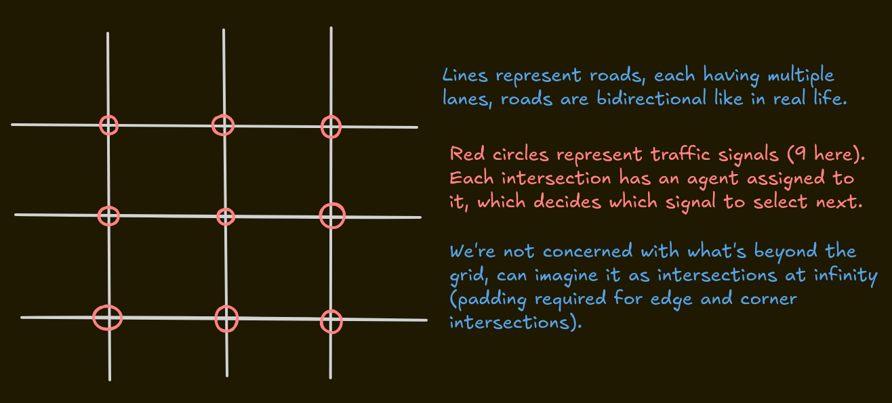

## Environment representation

In RL problems, or any other thing we try to solve by building software, we aim to build a representative model over the world to simplify things and get the essence of things, in order to test out possible ideas before going all in on complex implementations.

With this in mind, I have decided to make the initial environment a grid of roads, with traffic signals at each intersection. 



Agent of each intersection can get state info of 0,1,2,3,4 intersections neighboring it (depends on network). Information shared includes their local queues, local signal state and time spent in that local signal state.

Neighbor presence vector is binary int, 0 means abscence of neighbor while 1 means there is a neighbor in that direction. So a node in the middle of the network will have vector [1,1,1,1].

Direction order is always taken as NSEW.

Within a direction, order will always be left, straight, straight_right.
These three lanes define which direction the traffic needs to go through with respect to current orientation. Since traffic is on the right side of the road, right turns are allowed to happen even when the light is red (due to no risk of collision).

[local_queue_counts (12), local_signal_state (2), neighbor_presence_vector (4), padded_neighbor_info_block_N (14), padded_neighbor_info_block_E (14), padded_neighbor_info_block_S (14), padded_neighbor_info_block_W (14)]


Represented in a data structure, the inputs to an agent at any intersection will be given as:

```python

# Example State Vector Structure for ONE agent (including space for 4 neighbors)
# Total size: 12 (local lane queues) + 2 (local signal state) + 4 * (neighbor info size)
# Let's say neighbor info size is 12 (queues) + 2 (signal state) = 14 elements per neighbor slot
# Total size = 12 + 2 + 4 * 14 = 14 + 56 = 70 elements

state_vector = [
    # Local Queue counts (12 elements)
    queue_N_left, queue_N_straight, queue_N_straight_right,
    queue_S_left, queue_S_straight, queue_S_straight_right,
    queue_E_left, queue_E_straight, queue_E_straight_right,
    queue_W_left, queue_W_straight, queue_W_straight_right,

    # Local Signal State (2 elements)
    current_phase_index,
    time_in_current_phase,

    # Neighbor Information (4 blocks, each 14 elements)
    # --- North Neighbor Slot (Elements 14 to 27) ---
    # If North neighbor exists:
    neighbor_N_queue_E_to_Current_Left, # Queue on neighbor's E lane heading to Current N Left
    neighbor_N_queue_E_to_Current_Straight,
    neighbor_N_queue_E_to_Current_SRight,
    # ... (queues from all neighbor's outgoing lanes that arrive at current intersection) ...
    neighbor_N_signal_phase_index,
    neighbor_N_time_in_phase,
    # If North neighbor DOES NOT exist:
    # Fill all 14 elements with a placeholder value, e.g., -1.0

    # --- East Neighbor Slot (Elements 28 to 41) ---
    # If East neighbor exists: ... (14 elements of data) ...
    # If East neighbor DOES NOT exist: Fill all 14 elements with -1.0

    # --- South Neighbor Slot (Elements 42 to 55) ---
    # If South neighbor exists: ... (14 elements of data) ...
    # If South neighbor DOES NOT exist: Fill all 14 elements with -1.0

    # --- West Neighbor Slot (Elements 56 to 69) ---
    # If West neighbor exists: ... (14 elements of data) ...
    # If West neighbor DOES NOT exist: Fill all 14 elements with -1.0
]
```

Note: Although the neighbor presence vector is there to indicate presence or absence of a neighbor, we will still pad that neighbor's vector with zeros if it is absent. This makes the inputs to the NN standardized, and the former vector makes the network distinguish between absence of the network and zero queue length.

Reward comes from SUMO's api. Reward distribution is done before state update for the nn inputs, as we're padding absent states, which could cause issues if not done in order. 